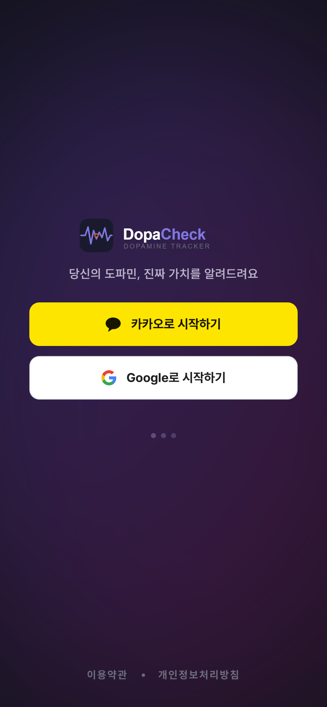
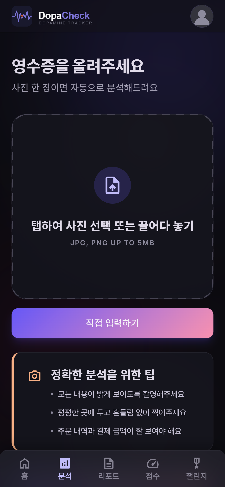
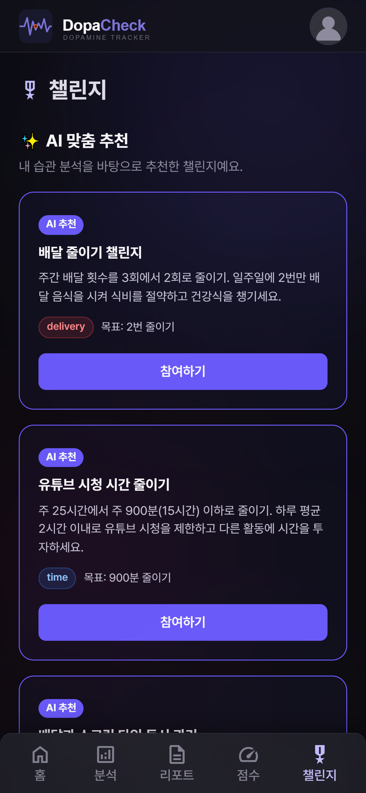
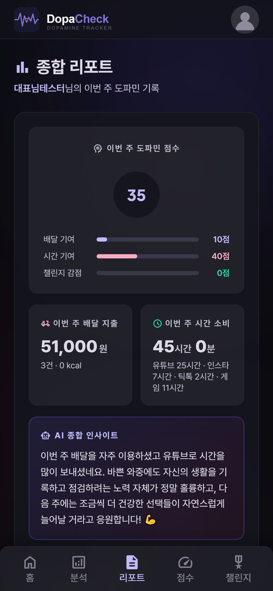
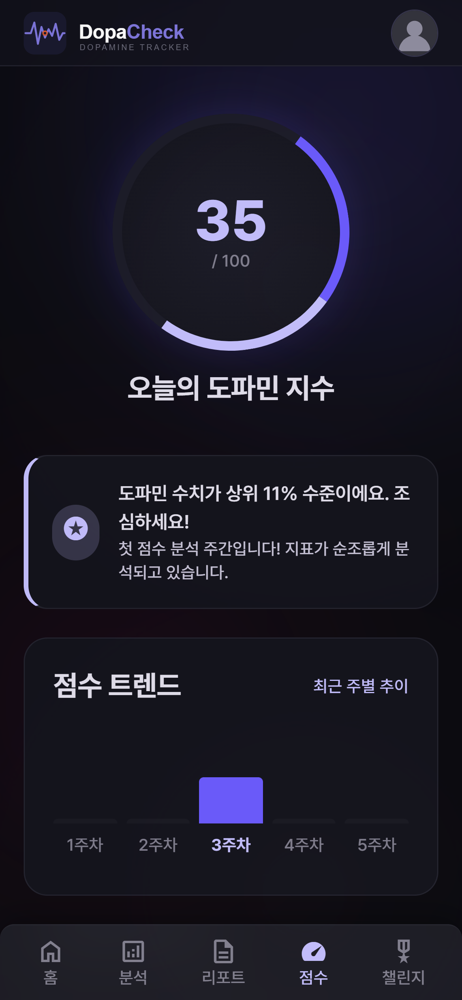
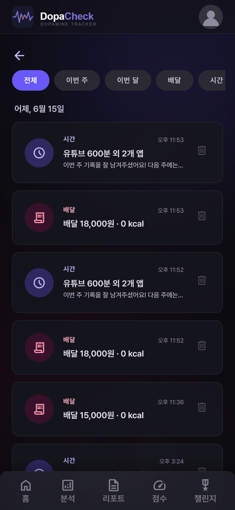

<div align="center">


# 🧠 도파민 체크 (DopaCheck)

**배달 한 번, 스크롤 한 시간 — 내 도파민 소비를 숫자로 마주하는 서비스**

영수증·사용시간을 올리면 AI가 일상 활동·금전 가치로 환산하고,
종합 도파민 점수와 맞춤 챌린지로 소비 패턴을 추적합니다.

[]()
[]()
[]()
[]()
[]()

🎬 **[시연 영상](https://youtu.be/v-mCKvA6tYQ)** · 📑 **[발표 자료(PDF)](docs/presentation.pdf)**

</div>

---

## 📌 프로젝트 정보

|  |  |
|---|---|
| **프로젝트명** | 도파민 체크 (DopaCheck) |
| **개발 기간** | 2026.06.10 ~ 06.17 (7일) |
| **팀 구성** | AI 심화 과정 6인 팀 |
| **핵심 개념** | 배달·디지털 소비 → 일상 활동·금전 가치 환산 → 도파민 점수화 |
| **배포** | Cloudtype (`main` push 자동 배포) |

---

## 👥 팀원 & 역할

> AI 심화 과정 **6인 팀 프로젝트** · 2026.06.10 ~ 06.17

| 🧑‍💻 정재봉 | 🧑‍💻 김승현 | 🧑‍💻 오영석 |
|:---|:---|:---|
| └ 오케스트레이션 총괄(설계·검수·머지·배포)<br>└ 초기 스캐폴딩(라우트·AI·DB스키마·테스트 뼈대)<br>└ 종합 리포트<br>└ 공통 인프라(DB풀·MariaDB 전환·PostCSS 빌드) | └ 소셜 로그인(Google/Kakao)<br>└ DB 총괄 운영<br>└ 홈 대시보드<br>└ 마이페이지<br>└ 점수 트렌드 차트(주차별)<br>└ PRD 문서 관리 | └ AI 모듈(추천·생성)<br>└ 챌린지(달성 판정·목록 필터)<br>└ OCR 프롬프트 개선<br>└ 챌린지 동시성(SELECT FOR UPDATE·복합 인덱스로 TOCTOU 차단) |
| **🧑‍💻 이은석** | **🧑‍💻 김관영** | **🧑‍💻 허남** |
| └ 배포 설정(Procfile·헬스체크)<br>└ 프론트엔드(헤더·아바타 드롭다운·파비콘)<br>└ 관리자 페이지(챌린지 관리·AI 추천·유저 상세)<br>└ 시간 분석 페이지(/time)<br>└ Stitch UI 제작 | └ 배달 영수증 분석 라우트<br>└ CSRF DRY 통합<br>└ FLASK_SECRET_KEY 보안<br>└ 세션 쿠키 보안<br>└ 모바일 대응(safe-area·햄버거 메뉴) | └ 히스토리 기능<br>└ 시간분석·점수/랭킹<br>└ 홈 "이번 주 핵심" 모달<br>└ 배달 상세 가격 분배 로직<br>└ XSS 방어 |

---


## 🎬 데모  / https://youtu.be/v-mCKvA6tYQ

| 로그인 | 배달 분석 | 챌린지 |
|:---:|:---:|:---:|
|  |  |  |
| **종합 리포트** | **도파민 점수** | **히스토리** |
|  |  |  |

---

## ✨ 핵심 기능

| 기능 | 설명 |
|------|------|
| 🍗 **배달 분석** | 영수증 사진 업로드 → AI(OCR) 자동 추출 → 지출·칼로리를 일상 활동으로 환산 + 공감 코멘트 |
| ⏰ **시간 분석** | 앱별 사용 시간 입력 → 대체 활동(책·강의·운동)·시급 기준 기회비용 환산 + 이번 주 누적 추적 |
| 📊 **종합 리포트** | 배달·시간·점수 통합 대시보드 + 주간 비교 차트 |
| 🔥 **도파민 점수** | 0~100 점수 산출, 전체 평균 대비 / 상위 N% 랭킹 |
| 🏆 **AI 챌린지** | 내 히스토리 기반 맞춤 챌린지 추천, 달성 시 점수 감점(=개선) |
| 👤 **소셜 로그인** | Google · Kakao OAuth |

---

## 🛠 기술 스택

| 영역 | 사용 기술 |
|------|----------|
| **백엔드** | Python 3.10 · Flask · Jinja2 · Gunicorn |
| **데이터** | MariaDB (커넥션 풀, 앱 레벨 `user_id` 격리) |
| **AI** | Claude API (OCR · 칼로리 추론 · 공감 코멘트 · 점수 · 챌린지 추천) |
| **인증** | OAuth 2.0 (Google · Kakao) |
| **프론트** | Tailwind CSS (PostCSS 빌드) · Chart.js |
| **배포** | Cloudtype (`main` push 자동 배포) |

---

## 🗂 아키텍처 & 데이터 모델

```
[Browser] ──HTTP──> [Flask App] ──> [Routes] ──> [Services] ──> [Repositories] ──> [MariaDB]
                         │
                         └──> [AI 모듈] ──> Claude API (OCR·환산·코멘트·챌린지)
```

<details>
<summary><b>📋 ERD — 6개 테이블 펼쳐보기</b></summary>

<br/>

| 테이블 | 역할 |
|--------|------|
| `users` | 회원 정보, OAuth 식별자, `role`(관리자 구분) |
| `delivery_records` | 배달 영수증 분석 결과(지출·칼로리·환산) |
| `time_records` | 앱별 사용 시간·기회비용 환산 |
| `dopamine_scores` | 일자별 종합 도파민 점수 |
| `challenges` | 챌린지 마스터(AI 추천·기본 제공) |
| `user_challenges` | 사용자별 챌린지 참여·달성 상태 |

> 전체 컬럼·제약은 [`db/schema.sql`](db/schema.sql) 참조.

</details>

---

## ⚡ 로컬 실행

> Python **3.10 이상** 필요 (소셜로그인 `authlib>=1.7` 요구사항).

```bash
git clone https://github.com/luma-team-ai/dopacheck.git
cd dopacheck

python3.10 -m venv .venv && source .venv/bin/activate
pip install -r requirements.txt

cp .env.example .env   # 환경변수 채우기

flask --app app run --debug   # http://localhost:5000
```

<details>
<summary><b>환경변수 펼쳐보기</b></summary>

<br/>

| 변수 | 설명 |
|------|------|
| `DB_HOST` / `DB_PORT` / `DB_USER` / `DB_PASSWORD` / `DB_NAME` | MariaDB 연결 |
| `DB_POOL_SIZE` / `DB_POOL_TIMEOUT` | 커넥션 풀 크기(기본 5) / 풀 소진 대기 한도 초(기본 30, 초과 시 503) — 선택 |
| `GOOGLE_CLIENT_ID` / `GOOGLE_CLIENT_SECRET` / `KAKAO_CLIENT_ID` | OAuth 자격증명 |
| `ANTHROPIC_API_KEY` | Claude API 키 |
| `FLASK_SECRET_KEY` | 세션 암호화 키 |
| `SESSION_COOKIE_SECURE` | 세션 쿠키 Secure 속성 — `true` 또는 `FLASK_ENV=production`이면 활성화 |

> ⚠️ `.env`는 절대 커밋하지 마세요.

</details>

---

## 📂 문서

- 📋 **[진행 현황 보드 → STATUS.md](docs/STATUS.md)** — 머지 이력·남은 작업·인프라
- 📑 **[제품 요구사항 → PRD.md](docs/PRD.md)** — 기능 명세(FR)·시나리오·ERD
- 🛠 **[개발팀 가이드 → DEV_GUIDE.md](docs/guide/DEV_GUIDE.md)** — 구조·역할·협업 규칙·배포·DB 전환 이력
- 🎬 **[시연 영상](https://youtu.be/v-mCKvA6tYQ)** · 📑 **[발표 자료(PDF)](docs/presentation.pdf)**
